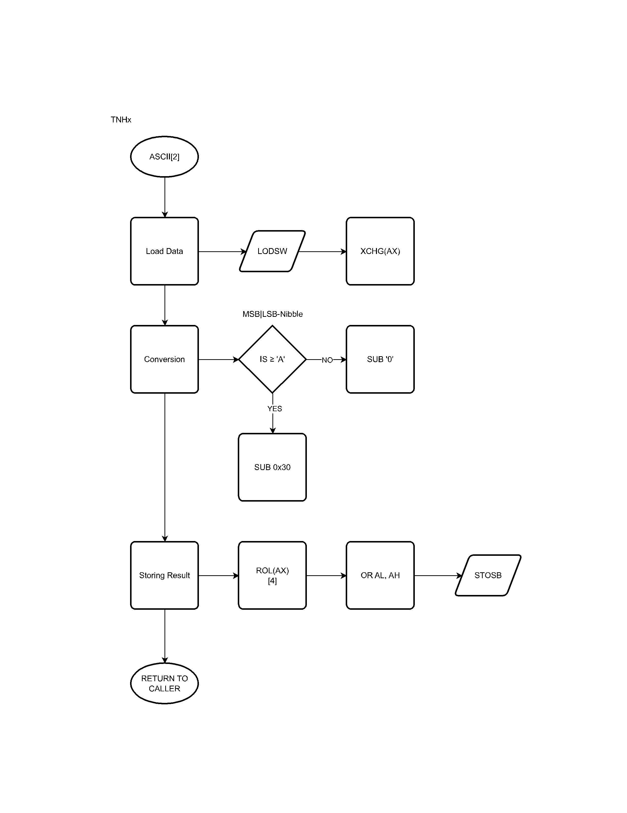

## INTERPRETER

> TLDR : Just interprets, validates and jumps to the selected option(s).

This stage is where the caller takes control to perform initial computations and setup before the conversion begins. It also performs basic validation before handing off control.

 

## OPTIONS LIST

|   **OPTION**  |   **NAME**    |   **PURPOSE (TLDR)**     |
|---------------|---------------|-------------------|
| 00h   | `HxNT`  | Hex Nibble to ASCII |
| 01h   | `THx`   | ASCII to Hex |
| 02h   | `TNHx`  | ASCII to Nibble Hex |

### Technical Explaination

[`HxNT`](#hxnt) = It converts the byte into ASCII, The byte contains 2 nibble.  
&emsp;&emsp;&emsp;&nbsp;&nbsp;
So &nbsp;what &nbsp;it &nbsp;does is to split the 2 nibble and treat them as  
&emsp;&emsp;&emsp;&nbsp;&nbsp;
2 characters. It stores the result in MSB from the pre-selec  
&emsp;&emsp;&emsp;&nbsp;&nbsp;
-ted ES:(E)DI.
 
[`THx`](#thx) &nbsp;&nbsp;= It converts 1 ASCII representing the same char in HEX.
 
[`TNHx`](#tnhx) = It converts 2 ASCII representing the same char in HEX.

 
 

# Flowcharts
### INTERPRETER

### HxNT

### THx

### TNHx
